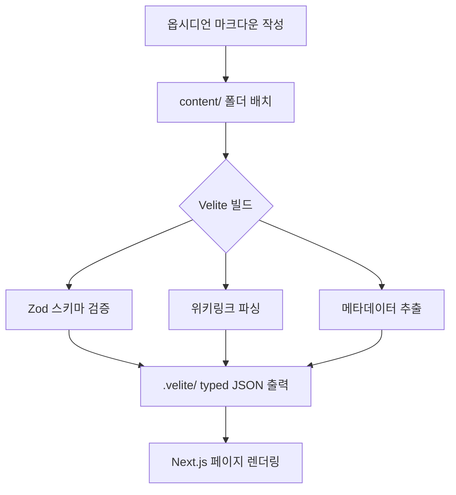

## 1. 제작 동기
### 1.1. 옵시디언 마크다운을 그대로 웹으로
평소 **옵시디언(Obsidian)** 을 개인 지식관리 도구로 사용하고 있습니다. 업무에 필요한 자료들 뿐만 아니라 블로그에 작성하는 글들도 모두 마크다운으로 작성하고 있는데, 이 콘텐츠를 **별도의 변환 과정 없이** 그대로 웹페이지로 만들 수 있으면 좋겠다는 생각이 출발점이었습니다.

특히 옵시디언의 핵심 기능들 — **그래프 뷰(Graph View), 백링크(Backlinks), 위키링크(WikiLinks), 메타데이터(Properties) 기반 탐색** — 을 웹에서도 그대로 사용하고 싶었습니다. 옵시디언에서 글을 쓰고 파일만 옮기면 사이트에 바로 반영되는 그런 매끄러운 **워크플로우**를 원했습니다.

뿐만 아니라 평소 전자책이나 가이드북 등 시리즈 형태의 긴 호흡을 가진 글들을 자주 작성하다 보니, 이를 체계적으로 보여줄 수 있는 **위키독스(WikiDocs)** 스타일의 문서(Docs)형 페이지 구현이 절절했습니다. 단순한 노트 공개를 넘어, **회계·재무 전문가로서의 퍼스널 브랜딩**을 담아낼 수 있도록 심플하면서도 신뢰감을 주는 전문적인 공간을 목표로 삼았습니다.

### 1.2. 기존 대안의 한계
옵시디언을 활용한 **디지털 가든(Digital Garden)** 을 만드는 방법은 이미 여러 가지가 있습니다.

- **Obsidian Publish**: 옵시디언 공식 퍼블리시 서비스
- **Quartz**: 옵시디언 마크다운을 정적 사이트로 변환하는 오픈소스

하지만 이들은 디자인이 **획일적**이고 커스터마이징에 한계가 있었습니다. 전문가로서의 아이덴티티를 표현하려면 남들과 같은 틀에서 벗어나야 했고, 원하는 기능도 더 필요했기에 직접 만들기로 결정했습니다.

## 2. 개발 중점사항 및 활용 툴
### 2.1. 인공지능(AI)스러움을 탈피한 디자인 지향
기존에 제작했던 웹사이트들에서 가장 아쉬웠던 점은 소위 **'AI스러운(AI-slop)'** 느낌이 강했다는 것이었습니다. 대개 AI 에이전트들은 **글래스모피즘(Glassmorphism)** 이나 화려한 **그라디언트(Gradient)** 색상을 과도하게 제안하는 경향이 있는데, 이는 얼핏 보기에는 화려해 보이지만 실제 상용 서비스로서는 소위 **'바이브 코딩(Vibe Coding)'**[^1]으로 만들어진 듯한 가벼운 인상을 주기 쉽습니다.

이번 프로젝트에서는 이러한 느낌에서 완전히 벗어나, 실제 상용화된 플랫폼과 같은 전문적인 분위기를 구현하는 데 집중했습니다. 이를 위해 **Vercel의 디자인 시스템**을 핵심 모티브로 삼았으며, 실제 코드를 작성하기 전 **디자인 가이드라인(Design.md)** 을 먼저 완성하여 전체적인 톤과 규칙을 정의했습니다. 이 가이드라인을 토대로 하나씩 커스터마이징해 나가는 방식을 택했습니다.

### 2.2. 클로드 코드(Claude Code) 
개발에는 **클로드 코드**를 핵심 도구로 활용했습니다. 기획안과 요구사항을 정리한 뒤, **계획(Plan) 모드**를 통해 프로젝트의 뼈대를 잡았습니다. 특히 앞서 수립한 디자인 원칙을 클로드 코드에게 학습시켜, AI가 임의로 생성하는 디자인이 아닌 철저히 의도된 시스템에 따라 각 페이지와 컴포넌트를 구현할 수 있었습니다.

## 3. 기술 스택
| 영역        | 기술                          | 선택 이유                                 |
| --------- | --------------------------- | ------------------------------------- |
| **프레임워크** | Next.js 15 (App Router)     | **SSG/SSR** 유연성, Turbopack으로 빠른 개발 환경 |
| **런타임**   | React 19, TypeScript        | 최신 서버 컴포넌트, **타입 안정성** 확보             |
| **콘텐츠**   | Velite                      | 마크다운 → typed JSON 변환, **Zod 검증**      |
| **스타일링**  | Tailwind CSS v4 + shadcn/ui | 유틸리티 퍼스트 디자인 + 일관된 컴포넌트               |
| **폰트**    | Pretendard + Geist Mono     | 한글 가독성 최적화 + 기술적인 모노스페이스 톤            |
| **검색**    | MiniSearch + SSR 검색         | 클라이언트 즉시 검색 + 강력한 고급 필터               |
| **그래프**   | react-force-graph-2d        | 위키링크 기반 **지식 그래프 시각화**                |
| **코드**    | Shiki                       | 고해상도 코드 하이라이팅, 다크/라이트 테마 지원           |
| **배포**    | Vercel                      | Next.js 네이티브 지원 및 글로벌 CDN 제공          |

이 중 핵심은 **Velite**입니다. 단순한 마크다운 렌더링을 넘어, 옵시디언 마크다운의 **프론트매터(Frontmatter)** 를 Zod 스키마로 검증하고, 위키링크를 파싱해 그래프 데이터를 생성하며, 읽기 시간과 목차를 자동 계산합니다. 빌드 결과물은 TypeScript 타입이 붙은 JSON으로, `import { posts, series, chapters } from '#site/content'` 한 줄로 모든 콘텐츠에 타입 안전하게 접근할 수 있습니다.

## 4. 프로젝트 구조
유지보수의 편의성을 위해 **콘텐츠(content)** 와 **웹 로직(src)** 을 명확하게 분리하여 구성했습니다.

```bash
content/                        # 콘텐츠 (옵시디언에서 작성)
├── 00. 인사이트/               # 독립 포스트 (서브카테고리 없이 직접 배치)
├── 01. 회계실무/
│   └── 01. ICFR/              # 서브카테고리 → 시리즈, 포스트
├── 02. AI&생산성/
│   └── 01. AI 활용/           # 서브카테고리 → 시리즈, 포스트
├── 03. 개발/
│   ├── 01. Web, App/
│   └── 02. MCP/
└── downloads/                  # 자료실 (첨부파일 메타)

src/
├── app/                        # Next.js App Router
│   ├── [...slug]/             # 카테고리/포스트/시리즈/챕터 (catch-all)
│   ├── downloads/             # 자료실 페이지
│   ├── explore/               # 탐색 (faceted search)
│   ├── graph/                 # 지식 그래프
│   ├── search/                # 고급 검색
│   └── api/og/               # OG 이미지 자동 생성
├── components/
│   ├── mdx/                   # MDX 컴포넌트 (Callout, FileDownload)
│   ├── vault/                 # INDEX 사이드바 트리
│   └── graph/                 # 그래프 시각화
└── lib/
    ├── topics.ts              # 카테고리 라벨/순서 정의
    ├── vault-tree.ts          # 사이드바 트리 빌드
    └── velite/                # remark 플러그인 (wiki-link, callout, graph)
```

**콘텐츠 파이프라인 흐름:**



### 4.1. 카테고리 자동 매핑
폴더명에서 **카테고리 키(Category Key)** 가 자동으로 추출됩니다. 폴더 정렬을 위한 번호 접두사(`00.`, `01.` 등)는 웹 URL 생성 시 자동으로 제거됩니다.

| 폴더명 | 카테고리 키 | URL 주소 |
|---|---|---|
| `00. 인사이트` | `인사이트` | `/인사이트` |
| `01. 회계실무` | `회계실무` | `/회계실무` |
| `02. AI&생산성` | `ai-생산성` | `/ai-생산성` |
| `03. 개발` | `개발` | `/개발` |

새로운 카테고리를 추가하고 싶다면 `content/` 아래에 단순히 폴더를 만들기만 하면 됩니다. 별도의 코드 수정 없이 시스템이 자동으로 인지하며, UI 라벨과 정렬 순서만 `src/lib/topics.ts`에서 관리합니다.

## 5. 주요 기능
### 5.1. INDEX 사이드바
옵시디언의 파일 탐색기 경험을 웹으로 이식했습니다. 카테고리와 서브카테고리를 **폴더 트리(Folder Tree)** 형태로 보여주며, 각 항목의 콘텐츠 수(시리즈는 챕터 수 기준)를 실시간으로 표시합니다. 카테고리를 클릭하면 해당 카테고리 페이지로 이동하여 시리즈 카드와 포스트 목록을 탐색할 수 있습니다.

### 5.2. 위키링크와 백링크
옵시디언의 `[[위키링크]]` 문법을 그대로 지원합니다. Velite 빌드 시 커스텀 remark 플러그인이 위키링크를 파싱하여 내부 링크로 변환하고, 동시에 백링크 인덱스를 생성합니다. 링크에 마우스를 올리면 대상 문서의 미리보기 툴팁이 표시되며, 포스트 하단에서는 "이 글을 참조한 문서" 목록을 확인할 수 있습니다.

### 5.3. 지식 그래프
위키링크로 연결된 문서 관계를 시각적으로 표현합니다. 카테고리별 색상 구분과 필터링을 지원하며, 노드를 클릭하면 해당 문서로 이동합니다.

- **Global Graph** (`/graph`) — 전체 문서의 연결 관계
- **Local Graph** — 각 포스트/챕터 페이지에서 인접 노드만 표시

### 5.4. 콜아웃(Callout)
옵시디언의 콜아웃 문법을 그대로 사용합니다. 커스텀 remark 플러그인이 blockquote 기반의 `> [!note]`, `> [!warning]` 등을 감지하여 스타일이 적용된 컴포넌트로 변환합니다. 13가지 타입과 접기/펼치기(`+`, `-`) 기능을 지원합니다.

### 5.5. 탐색
모든 콘텐츠를 카테고리, 타입(포스트/시리즈/챕터), 태그, 연도 등으로 필터링해서 탐색할 수 있습니다.

### 5.6. 검색 시스템
아래와 같이 두가지 검색 기능을 제공합니다.

- **커맨드 팔레트(`Ctrl+K`)**: `MiniSearch` 기반의 즉각적인 클라이언트 사이드 검색
- **고급 검색**: 서버 사이드에서 키워드와 메타데이터를 효과적으로 조합하여 검색

### 5.7. 자료실(첨부파일 다운로드)
포스트 본문에서 `/files/`로 향하는 마크다운 링크(`[이름](/files/파일명)`)를 자동으로 다운로드 카드 UI로 변환합니다. 파일 확장자에 따라 아이콘(엑셀, PDF, 이미지 등)이 달라지고 클릭하면 파일이 다운로드됩니다.

별도의 자료실 페이지(`/downloads`)에서는 모든 첨부파일을 카테고리별로 한눈에 볼 수 있습니다. Velite 컬렉션으로 관리되어 제목, 설명, 태그를 포함한 메타 정보와 함께 표시됩니다.

## 6. 웹사이트 구축 방법
나만의 옵시디언 볼트(Vault)를 웹사이트로 변환하고 관리하는 전 과정을 **5단계(Phase)**로 나누어 상세히 설명해 드리겠습니다. (비개발자 분들도 쉽게 따라 하실 수 있도록 구성했습니다.)

### 6.1. 1단계: 프로젝트 환경 구성
가장 먼저 개발 환경과 콘텐츠를 담을 바구니를 준비해야 합니다.

- **GitHub 저장소 복사(Fork)**: 먼저 [PROCPA 옵시디언 스타일 저장소](https://github.com/procpalee/procpa_obsidian_style)에 접속합니다. 우측 상단의 **'Fork'** 버튼을 클릭하여 본인의 계정으로 프로젝트 전체를 복사해 옵니다. 이것이 웹사이트의 핵심 '뼈대'가 됩니다.
- **Node.js 설치**: 웹사이트 엔진을 구동하기 위해 컴퓨터에 [Node.js](https://nodejs.org/)(LTS 버전)를 반드시 설치해야 합니다.
- **로컬 서버 실행**: 복사한 프로젝트 폴더에서 터미널(또는 명령 프롬프트)을 열고 `npm install`을 입력해 필요한 도구들을 설치합니다. 그 후 `npm run dev`를 입력하면 내 컴퓨터(`localhost:3000`)에서 즉시 웹사이트를 확인할 수 있습니다.

### 6.2. 2단계: 카테고리 설정 및 문서 작성
가장 즐거운 단계인 '글쓰기' 단계입니다.

- **카테고리 폴더 만들기**: `content/` 폴더 아래에 `01. 회계실무`, `02. 인사이트`와 같이 번호를 붙인 폴더를 만듭니다. 이 번호는 웹에서의 **정렬 순서**를 결정하며 URL 주소에서는 자동으로 생략됩니다.
- **문서(Markdown) 작성**: 옵시디언에서 평소처럼 글을 작성하되, 문서 최상단에는 아래와 같이 필수 정보를 담은 **프론트매터(Frontmatter)**를 반드시 포함해야 합니다.

```yaml
---
title: 글 제목
description: 검색 결과나 SNS 공유 시 나타날 요약문 (300자 이내)
date: 2026-04-13
tags: [세무, 법인세, AI]
---
```

### 6.3. 3단계: 지식의 연결 (링크와 시리즈)
옵시디언의 강력한 지식 연결 기능들을 웹 환경에서 구현합니다.

- **위키링크(WikiLinks)**: `[[다른 문서 제목]]` 문법을 사용하면 웹에서도 자동으로 클릭 가능한 내부 링크와 미리보기 툴팁이 생성됩니다.
- **콜아웃(Callout)**: `> [!note]` 같은 문법을 그대로 사용하면 웹에서도 세련된 안내 박스로 자동 렌더링됩니다.
- **시리즈(Series/ebook) 구성**: 전자책처럼 여러 챕터를 묶고 싶다면, 서브폴더를 만들고 그 안에 `index.md`(시리즈 정보)와 각 챕터 파일들을 순차적으로 넣으시면 됩니다.

### 6.4. 4단계: 자료실 및 첨부파일 관리
실무에서 자주 쓰이는 엑셀 템플릿이나 PDF 자료를 공유하는 방법입니다.

- **파일 저장**: 공유하고자 하는 실제 파일은 `public/files/` 폴더에 저장합니다.
- **메타데이터 등록**: `content/downloads/` 폴더에 해당 파일의 정보를 담은 마크다운 파일을 작성합니다.
- **다운로드 카드**: 본문에서 해당 파일을 링크(`[파일명](/files/abc.xlsx)`)하면, 웹사이트 상에서는 깔끔한 **다운로드 카드 UI**가 자동으로 생성됩니다.

### 6.5. 5단계: Vercel을 통한 자동 배포
마지막으로 내 지식 정원을 전 세계에 공개하는 전용 주소를 만드는 단계입니다.

- **Vercel 계정 연결**: [Vercel](https://vercel.com/)에 가입한 뒤, 아까 복사(Fork)해둔 GitHub 저장소를 선택하여 **'Import'** 합니다.
- **무료 호스팅 시작**: 별다른 설정 없이 'Deploy' 버튼을 누르면 나만의 고유한 웹사이트 주소가 생성됩니다.
- **자동 업데이트**: 이제 GitHub에 새로운 글을 올리거나 수정하기만 하면, Vercel이 이를 감지하여 수 초 내로 웹사이트에 자동으로 반영해 줍니다. (별도의 복잡한 배포 과정이 필요 없습니다.)

> [!tip] 실전 팁
> 
> 콘텐츠를 수정하고 저장하면 웹 엔진(`Velite`)이 실시간으로 내용을 읽어와 에러가 없는지 체크해 줍니다. 터미널 창의 메시지를 확인하며 작업하시면 오타나 문법 오류를 즉각 수정할 수 있습니다.

## 마치며
전문가로서의 **퍼스널 브랜딩**을 꿈꾸거나, 자신만의 파편화된 지식을 체계적인 웹사이트로 구축하고 싶은 분들에게 이 프로젝트가 실질적인 도움이 되기를 바랍니다. 구현 과정에서 어려움을 겪으시거나 궁금한 점이 있다면 언제든 댓글이나 메일로 문의해 주세요. 여러분의 지식 정원이 멋지게 피어날 수 있도록 성심껏 돕겠습니다.

[^1]: **바이브 코딩(Vibe Coding)**: 정교한 설계나 코드 이해 없이 AI의 제안(Vibe)에만 의존하여 개발하는 방식.